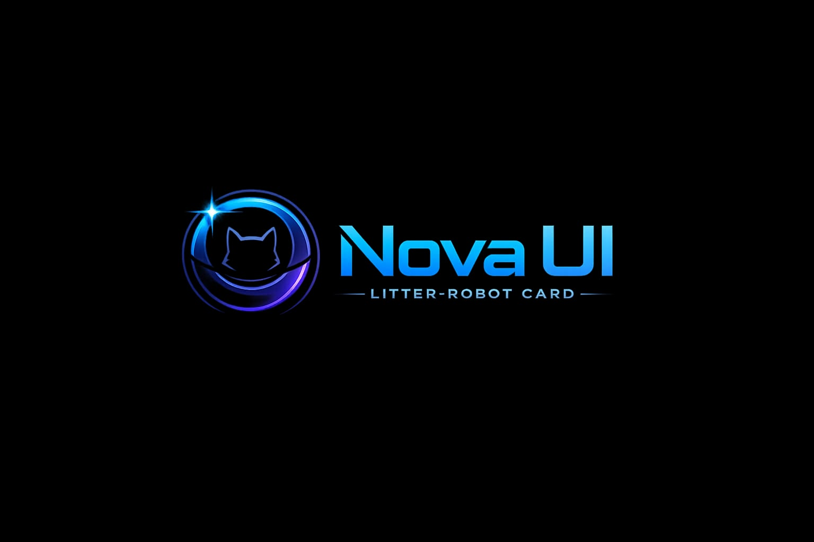

  

> [!NOTE]
> **This is an English fork of [smokedropp23/ha-litter-robot-card](https://github.com/smokedropp23/ha-litter-robot-card).**
> Upstream hardcodes every user-visible string in German with no language option; this fork translates
> them to English and drops the German decimal-comma formatting. No behaviour is changed otherwise.
>
> Forked at upstream tag `v0.3.0-alpha.6` (commit `e0094d5`). Note that upstream's *released asset* at
> that tag is stale relative to its own `src/` — it was built before the "Make status chips interactive"
> commit. This fork builds from `src/`, so it includes that change.
>
> To pull upstream changes: rebase onto upstream `main`, re-translate any new strings, run `npm run build`,
> and cut a new tag + release with `dist/ha-litter-robot-card.js` attached as an asset.

> [!WARNING]
> This project is currently available as a public alpha release.
> Features and configuration options may still change.

# 🚀 Nova UI

## Litter-Robot Card

*A premium Home Assistant Lovelace card*

## 📖 Vision

The goal of this project is to create the most realistic and elegant Litter-Robot 4 card for Home Assistant.

Instead of displaying plain sensor values, the card should feel like an extension of the original device itself.

Our focus is on a clean, modern and highly visual user experience that blends seamlessly into Home Assistant dashboards.

---

---

## 📸 Screenshots

### Full Card

The complete Nova UI Litter-Robot Card with live device status, cat tracking, litter and waste levels, system information, and controls.

  

### Mobile Layout

The responsive mobile layout keeps the card readable and easy to use on smaller screens.

  

### Dynamic Status Display

The device LED and status indicator automatically react to the current Litter-Robot state.

  

### Cat Tracking

Each configured cat can be displayed with its photo, converted weight in kilograms, and daily visit count.

  

### Device Controls

The card provides direct controls for starting and stopping a cleaning cycle and resetting the Litter-Robot.

  

---

## ✨ Planned Features

- Dynamic LED ring
- Realistic device rendering
- Live status visualization
- Litter level
- Waste drawer level
- Cat weight
- Cycle counter
- Maintenance reminders
- Beautiful animations
- Responsive layout
- Home Assistant theme support
- HACS installation
- Easy configuration
- High performance

---

## 🚀 Roadmap

### Version 0.1.0

- [x] Repository created
- [x] Project vision
- [x] Display first device image
- [x] Dynamic LED ring
- [x] Connect first Home Assistant entity

### Version 0.2.0

- [x] Status panel
- [x] Litter level
- [x] Waste drawer level
- [x] Cat weight
- [x] Cycle counter

### Version 0.3.0

- [x] Control buttons
- [ ] Smooth animations
- [x] Mobile optimization
- [ ] Theme support

### Version 0.4.0

- [ ] Configuration editor
- [ ] Advanced customization
- [ ] Performance improvements

### Version 1.0.0

- [ ] Complete documentation
- [ ] Installation guide
- [ ] HACS release
- [ ] Stable public release

---

## 🎨 Design Goals

Our goal is not only to display information but to recreate the original look and feel of the physical Litter-Robot.

The card should feel like a natural extension of the device itself.

---

## 🤝 Contributing

Ideas, suggestions and feedback are always welcome.

If you would like to contribute, feel free to open an Issue or submit a Pull Request.

---

## ❤️ Current Status

The project has officially started.

Development is currently focused on the first visual prototype.
